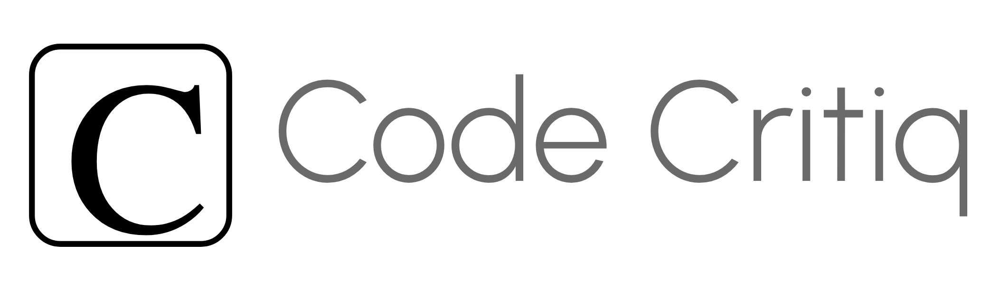
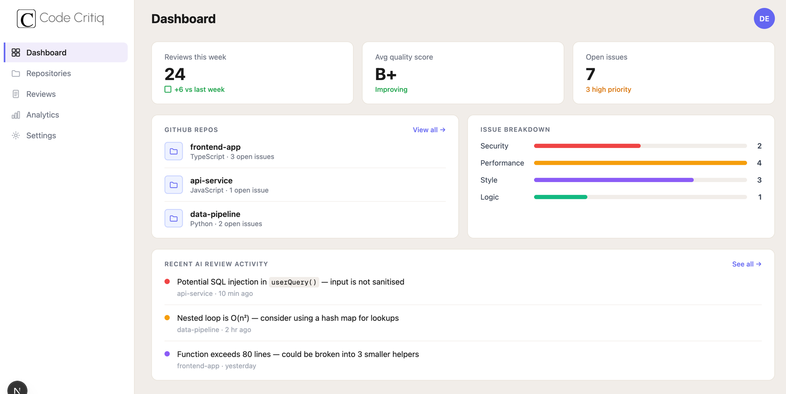

# Code Critiq

Automated pull request reviewer. Connects to your GitHub account and delivers code reviews directly on your pull requests.

<div align="center">

  

</div>

<div align="center">
  
</div>

## Overview

Code Critiq streamlines the code review process by analyzing pull requests and generating actionable feedback including catching bugs, flagging anti-patterns, and suggesting improvements so that human reviewers can focus on higher-level decisions.

---


<div align="center">
  
</div>

---

## Features

- Automated code review on pull requests
- AI-generated feedback (bugs, anti-patterns, suggestions)
- Supports any GitHub repository
- Downloadable detailed review reports

---

## Live Demo

**[https://code-critiq.vercel.app](https://code-critiq.vercel.app)**


---


## Getting Started

### Prerequisites

- Node.js 20+
- A GitHub OAuth App ([create one here](https://github.com/settings/developers))

### Local Setup

1. Clone the repository:

```bash
git clone https://github.com/your-username/Code-Critiq.git
cd Code-Critiq/client
```

2. Install dependencies:

```bash
npm install
```

3. Create a `.env.local` file in `client/`:

```env
NEXT_PUBLIC_GITHUB_CLIENT_ID=your_github_oauth_client_id
```

4. Start the development server:

```bash
npm run dev
```

The app will be available at `http://localhost:3000`.

---

## Available Commands

Run all commands from the `client/` directory.

| Command | Description |
|---|---|
| `npm run dev` | Start development server |
| `npm run build` | Build for production |
| `npm run lint` | Run ESLint |
| `npm test` | Run tests once |
| `npm run test:watch` | Run tests in watch mode |

---

## Contributing

Contributions are welcome. Please read the [Contributing Guide](CONTRIBUTING.md) before opening a pull request.

---

## License

[MIT](LICENSE) (c) 2026 Gautam Sihag
